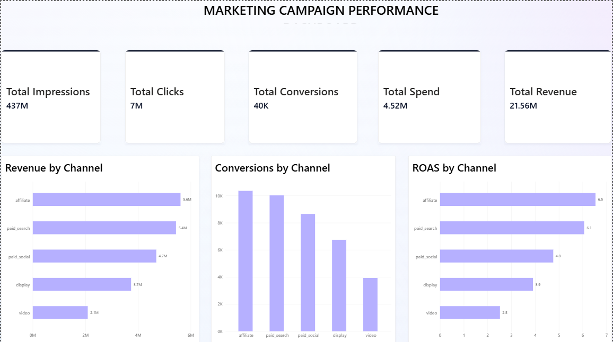
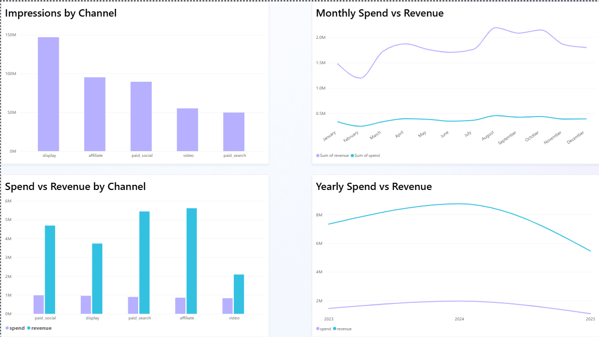

# Marketing Campaign Analysis

## Business Problem
Which marketing channels and campaigns are most effective? Where should marketing spend be optimized?

## Objective
This project analyzes marketing campaign performance across different channels and campaigns using Excel and Power BI. It focuses on spend, conversions, revenue, and campaign efficiency.

## Tools Used
- Microsoft Excel
- Power BI
   
## Dataset
Around 11,000 rows of daily campaign-level marketing data (2023–2025) including:
- Campaign date
- Campaign ID
- Marketing channel
- Impressions
- Clicks
- Leads
- Conversions
- Spend
- Revenue

## Analysis Performed

**Excel**
- Duplicate and missing-value checks
- CTR calculation
- Lead Conversion Rate
- Cost per Conversion
- ROAS
- Channel-level analysis
- Campaign-level analysis
- Monthly performance analysis

**Power BI**

The dashboard includes:
- Total Impressions, Total Clicks, Total Conversions, Total Spend, Total Revenue
- Revenue by Channel
- Conversions by Channel
- ROAS by Channel
- Impressions by Channel
- Spend vs Revenue by Channel
- Monthly Spend vs Revenue
- Yearly Spend vs Revenue

## Key Business Questions
1. Which marketing channels generate the most revenue?
2. Which channels provide the strongest return relative to spending?
3. Which campaigns perform best?
4. Which channels may require spending optimization?
5. How does campaign performance change over time?

## Key Findings
- **Affiliate is the most efficient channel**. Despite mid-range spend (857.8K), it generated the highest revenue (5.61M) and the best ROAS (6.54x) of any channel.
- **Paid Search is a close second on efficiency**. It has ROAS of 6.06x, achieved with the fewest impressions of any channel (49.8M), suggesting highly targeted, high-intent traffic.
- **Display drives the most reach but the weakest efficiency among top spenders**. It has 147M impressions (34% of all impressions) but only 3.91x ROAS, the second-lowest of the five channels.
- **Video is the weakest channel overall**, with the lowest revenue (2.09M), lowest ROAS (2.52x), and lowest conversions (3,933) despite meaningful spend (828K).
- **CMP0060 was the top individual campaign**, generating 417.7K in revenue at roughly 6.7x ROAS the strongest of all 120 campaigns.
- **Clear seasonality**: both spend and revenue peak between August–October each year and dip in February.
- **2024 was the strongest year** with overall (8.76M revenue on 1.97M spend).

## Recommendations
1. **Shift budget from Video toward Affiliate and Paid Search**, given the 2.5–4x ROAS gap between them.
2. **Study CMP0060 and other top campaigns** for replicable creative, targeting, or timing patterns.
4. **Increase spend during Aug–Oct seasonal peak** and consider trimming spend in the February trough.
5. **Monitor Paid Social** as the channel with the most room to close the efficiency gap relative to its revenue scale.

## Dashboard
The Power BI dashboard provides an interactive view of marketing campaign performance and allows users to filter results by channel, campaign, and date.






## Project Structure
```
Marketing Campaign Analysis/
├── README.md
├── data/          # original source data
├── excel/         # workbook with cleaning, pivot tables, and calculated metrics
├── powerbi/       # Power BI file 
└── screenshots/   # dashboard images
```
